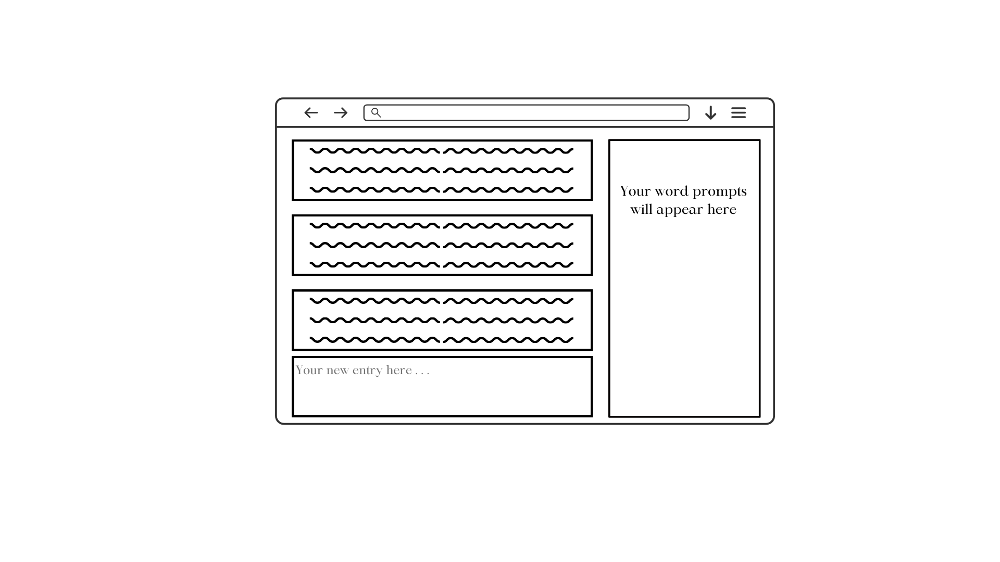

# Project 2: A Mile In Her Mind

## Project idea and description

My app is a word prompt for journaling and poetry entries. The application will prompt the user 1 - 3 words for them to integrate into a journal entry or poem. They will then be able to write an entry in the application for themselves or to share. All entries can be shared, updated, or deleted. If you choose to share your entry, other users have the option to comment or favorite it. You, as the user, can also favorite words that have come up in previous prompts.

## Wireframe

