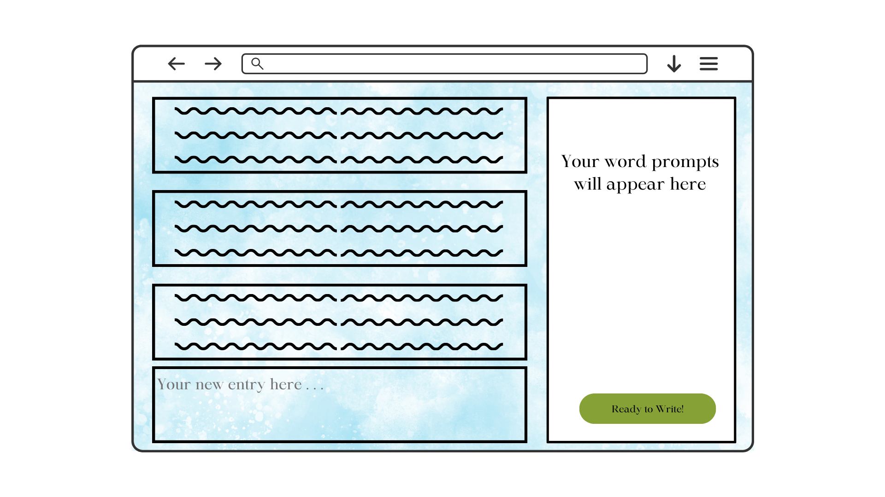
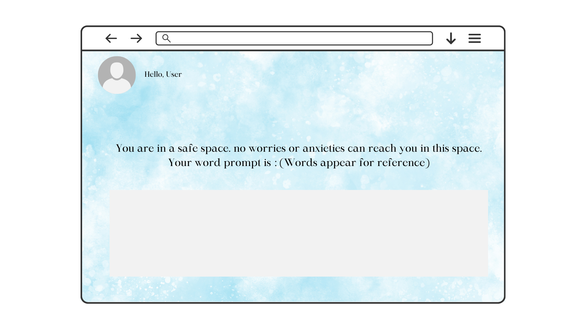
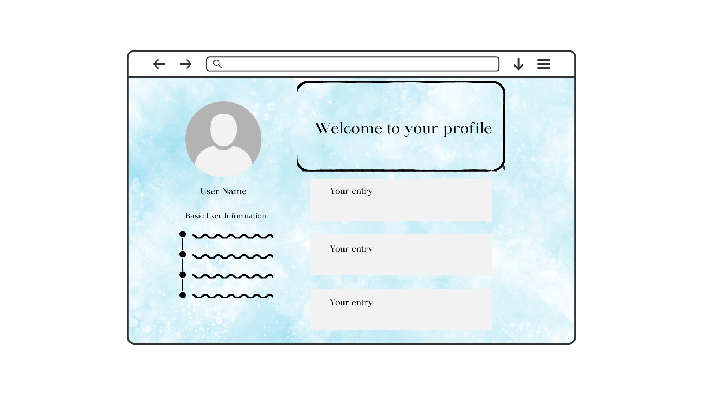
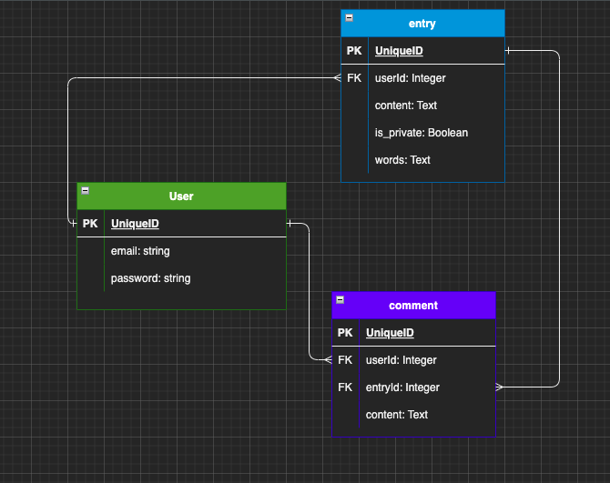

# Project 2: A Mile In Her Mind

## Project idea and description

My app is a word prompt for individuals who have experienced trauma to journal or write about their feelings on their trauma. The application will prompt the user 1 - 3 words for them to integrate into a journal entry or poem. They will then be able to write an entry in the application for themselves or to share. All entries can be shared, updated, or deleted. If you choose to share your entry, other users have the option to comment or favorite it. You, as the user, can also favorite words that have come up in previous prompts.

## Choice of API

Random-words-API - https://random-words-api.vercel.app/word

## Wireframe

## ERD

## RESTful routes
| HTTP METHOD (_Verb_) | URL (_Nouns_)        | CRUD    | Response                             | Notes                                                                                                                    |
| -------------------- | -----------------    | ------- | ------------------------------------ | ------------------------------------------------------------------------------------------------------------------------ |
| GET                  | `/entry`             | READ    | Array of entries you've made `{ [ entry1, entry2 ] }`  | allows a user to find all entries they've made                                                                                    |
| GET                  | `/entries/:entry_id` | READ    | Single entry `{ entry }`                               | details view of a single entry (aka `/entry/1234`)                                                                                |
| POST                 | `/entry`             | CREATE  | new entry is created `{ entry }`                       | can send back a status `204` (no content), a redirect to where to find data (GET `/entries/:entry_id`) or just the new entry data |
| PUT/PATCH            | `/entries/:entry_id` | UPDATE  | updated entry `{ entry }`                              | can send back a status `204` (no content), a redirect to where to find data (GET `/entries/:entry_id`) or just the new entry data |
| DELETE               | `/entries/:entry_id` | DESTROY | Delete an old entry or shared entry                    | can send back a status `204` (no content), a redirect to where to find data (GET `/entries`)                                      |

## MVP 
 - user is able to log in 
 - user is able to write an entry
 - user is able favorite other user entries
 - user is able to see 1 - 3 words for their prompt
 

## stretch goals
- calm music in the background of entry page
- Anxiety attack button -- for users who have panic attacks mid-entry. The button will connect them to a serene scene and play a meditation that reminds them they are safe now
- access past entries by clicking prompted word in the list of your past prompts